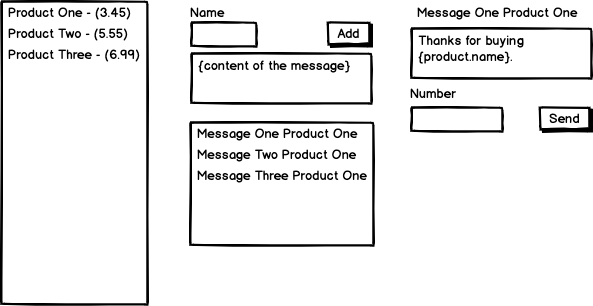

# Postscript

## Environment Setup

https://opensource.com/article/19/5/python-3-default-mac

## Run

1. `source venv/bin/activate`
2. `pip install -r requirements.txt`
3. `flask run`

## Use Cases

Three Column view

Products List | Messages List | Message Content



### List Products

- Each Product displays name, price and a Add Message Button and Text Area, is aligned on the left
- Each Product on click lists the messages associated on the right 
  
### Save Messages
- A new Message is created bound to a product

### List Messages
- Each message displays its name, on click it populates the rightmost view with the content

### Send Message
- Displays the content of the message with the variables populated
- Validates the phone number
- Sends to Twilio


## Models

[Product] 1 — * [Message]

**Product**
- id
- name
- price 

**Message**
- name
- content 
- productId (ref)
- id


### Routes

```
GET /
```
List Products
```
POST /messages
```
Save a Message

```
GET /messages
```
List Messages

```http
POST /messages/:id/send
```
Sends Message

## TODO

- [x] Setup environment
- [x] Create mock routes
- [x] Create migration to create model
- [X] Add views from server
- [X] Create simple HTML UI
- [X] ~~Seed three products~~
- [x] Populate server rendered HTML from models
- [x] Fix home view
- [x] Add selected product handler and fix view
- [X] Add Create Message form handler
- [X] Add selected message handler and fix view
- [X] Switch message list depending on product
- [X] Store a message
- [X] Make routes work 
- [X] Send Message Through Twilio
- [x] Organize BE code
- [ ] Add React to UI 

